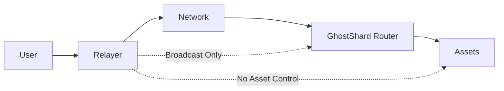
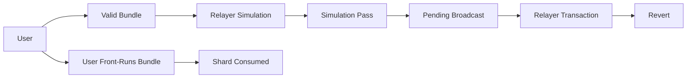
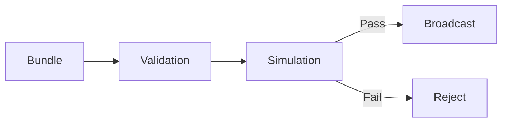
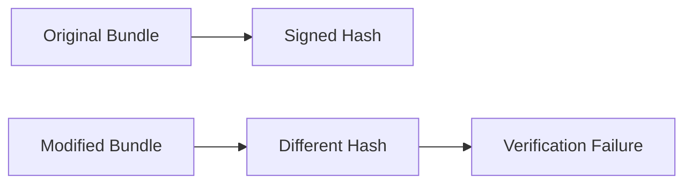
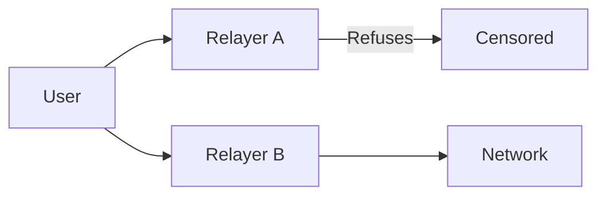

## 10.5 Relayer Security

> **Question:** Can relayers be exploited, censored, or forced to operate at a loss?

Relayers serve as transaction broadcast infrastructure within GhostShard. They receive transaction bundles, validate them, and submit them to the network.

Unlike routers, relayers do not participate in authorization generation or asset ownership. Their role is operational rather than custodial.

This section analyzes the trust assumptions, attack surfaces, economic risks, and censorship considerations associated with relayer operation.

---

### 10.5.1 Security Model

Relayers occupy an infrastructure role between users and the blockchain.

The relayer may observe transaction bundles and choose whether to broadcast them, but it cannot independently authorize asset movement.

This creates a strict separation between:

* Broadcast authority.
* Spending authority.

As a result, relayer compromise cannot directly result in asset theft.

---

### 10.5.2 Trust Assumptions

GhostShard assumes that relayers:

* Broadcast transactions they choose to accept.
* Maintain accurate local accounting.
* Perform validation before submission.
* Simulate execution before accepting economic exposure.

GhostShard does **not** assume that relayers are honest, censorship-resistant, or continuously available.

A relayer may:

* Refuse service.
* Delay submission.
* Log transaction data.
* Prioritize certain users.
* Censor transactions.

However, the relayer is intentionally excluded from critical authorization paths.

---

#### Fund Safety

A relayer cannot:

* Create transfer commands.
* Forge shard signatures.
* Redirect outputs.
* Modify recipients.
* Spend user assets.

Every transfer remains authorized by shard-owner signatures.

Even a malicious relayer lacks the credentials required to create valid spending authorizations.

---

#### Privacy Limitations

Relayers observe the full transaction bundle they broadcast.

Depending on architecture, they may see:

* Commands.
* Announcements.
* Gas parameters.
* Sponsorship information.
* Submission timing.

However, relayers do not possess:

* Viewing keys.
* Shard private keys.
* Ownership discovery capabilities.

Consequently, observing a bundle does not automatically reveal sender-recipient relationships.

Privacy implications were analyzed separately in Chapter 8.

---

### 10.5.3 Authorization Front-Running and Relayer Bleeding

The primary relayer-specific threat in GhostShard is not unauthorized spending but **authorization griefing**.

A malicious user may attempt to cause a relayer to pay gas for a transaction that was valid during simulation but becomes invalid before inclusion.

The attack proceeds as follows:

The user:

1. Constructs a valid transaction bundle.
2. Obtains sponsorship approval.
3. Submits the bundle to a relayer.
4. Allows the relayer to simulate successfully.
5. Independently broadcasts the same authorization before the relayer transaction is included.

Because the shard is consumed by the user's transaction first,

$$
\texttt{isShardSpent[shard]} = \texttt{true}
$$

when the relayer transaction executes.

The relayer transaction therefore reverts despite having passed simulation.

In this scenario:

* The user does not lose funds.
* No unauthorized spending occurs.
* The protocol remains secure.
* The relayer may incur transaction costs.

This is a **griefing attack** rather than a theft attack.

---

#### Why the Attack Does Not Compromise Fund Safety

The attacker gains no ability to:

* Spend another user's assets.
* Modify transaction contents.
* Forge signatures.
* Bypass authorization checks.

The only effect is the potential creation of relayer costs.

Consequently, the attack impacts relayer economics rather than protocol security.

---

#### Mitigations

GhostShard reduces the practical impact of authorization griefing through several mechanisms.

**Relayer policy controls**

Relayers may:

* Restrict service to known users.
* Require deposits.
* Maintain reputation systems.
* Rate-limit repeated offenders.

**Economic filtering**

Repeated griefing creates a detectable behavioral pattern.

Relayers can blacklist users that repeatedly submit bundles that become invalid shortly after simulation.

**Private submission paths**

A relayer may submit transactions through private infrastructure rather than the public mempool, reducing the opportunity for the originating user to race the relayer's transaction.

**Future protocol improvements**

Future versions may introduce:

* Relayer deposits.
* Submission commitments.
* Anti-griefing bonds.
* Inclusion commitments.
* Relay reputation networks.

These mechanisms can further reduce economic exposure without changing authorization security.

---

### 10.5.4 Simulation and Validation

Relayers perform local validation before broadcast.

This protects relayers from:

* Invalid signatures.
* Malformed bundles.
* Invalid sponsorship approvals.
* Predictable execution failures.

Simulation cannot eliminate authorization-front-running griefing because the bundle is genuinely valid at simulation time.

However, it prevents relayers from wasting gas on transactions that are already invalid before submission.

### 10.5.5 Bundle Manipulation Resistance

A malicious relayer may attempt to alter a transaction before submission.

Examples include:

* Removing commands.
* Reordering commands.
* Replacing announcements.
* Injecting additional operations.

These attacks fail because transaction validity depends on cryptographic commitments.

The bundle is protected by:

* Shard-owner signatures.
* Sponsorship signatures.
* Authorization validation.

Any modification changes the committed transaction hash and invalidates the associated approvals.

Consequently, relayers can choose whether to broadcast a bundle, but cannot safely modify it.

---

### 10.5.6 Censorship Risks

The relayer's most significant power is the ability to refuse service.

A relayer may:

* Ignore requests.
* Delay broadcasting.
* Prioritize specific users.
* Selectively censor transactions.

This does not compromise fund safety but may affect transaction availability.

GhostShard mitigates censorship through optionality rather than protocol enforcement.

Users may:

* Submit through alternative relayers.
* Operate private relayers.
* Broadcast directly.
* Use self-funded execution.

As long as at least one submission path remains available, censorship by a single relayer cannot permanently block protocol usage.

---

### 10.5.7 Relayer Decentralization Assumptions

GhostShard v0 does not require a decentralized relayer network.

Instead, it assumes that users have access to at least one functioning submission path.

The protocol therefore tolerates:

* Relayer failures.
* Relayer churn.
* Relayer replacement.
* Partial relayer censorship.

Future versions may explore:

* Decentralized relay networks.
* Shared broadcast infrastructure.
* Reputation systems.
* Relay marketplaces.

However, these are improvements to availability rather than requirements for security.

---

### 10.5.8 Security Conclusion

Relayers occupy an operational role rather than a custodial one.

A relayer may:

* Observe bundles.
* Refuse service.
* Delay submission.
* Consume infrastructure resources.

A relayer cannot:

* Spend assets.
* Forge authorizations.
* Modify valid transactions.
* Redirect transfers.

The primary risks are therefore economic and availability-related rather than authorization-related.

Under the GhostShard security model, relayer compromise may affect transaction delivery but does not compromise fund safety or authorization integrity.
