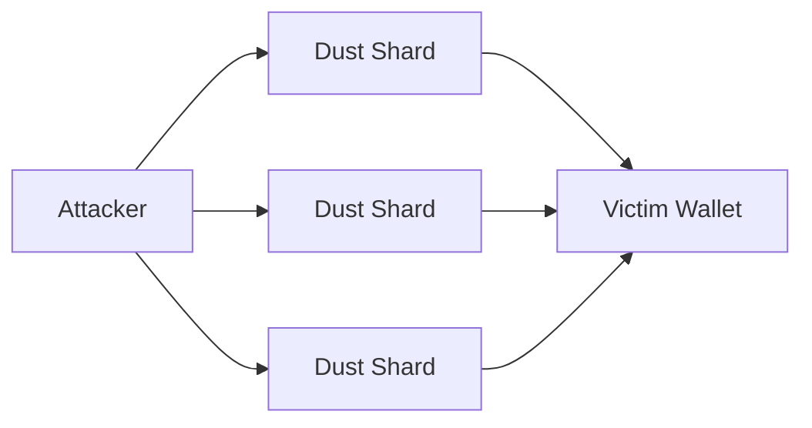
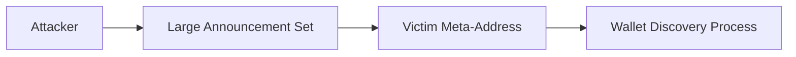
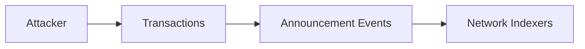
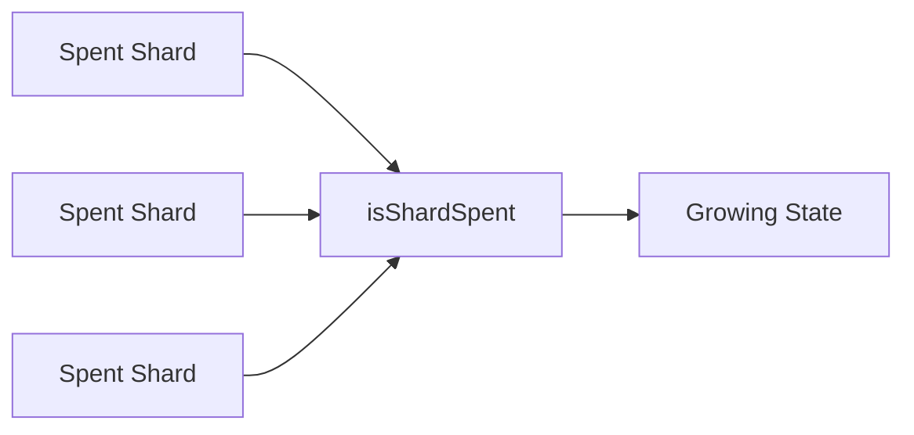
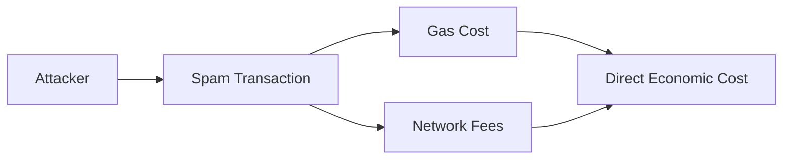

## 10.6 Shard Abuse and Spam Resistance

> **Question:** Can protocol state, wallet state, or discovery infrastructure be polluted or weaponized?

GhostShard introduces new protocol objects, including shards, announcements, and ownership-discovery mechanisms. As with any public system, an adversary may attempt to exploit these structures to increase costs, degrade usability, or create operational burdens for users and infrastructure providers.

This section analyzes the primary spam and state-growth vectors within the GhostShard architecture.

---

### 10.6.1 Dust Shard Attacks

A dust attack attempts to create large numbers of economically insignificant shards owned by a victim.

An attacker may repeatedly send very small amounts of ETH or tokens to stealth addresses associated with a target user.

The objective is not theft but state pollution.

Potential consequences include:

* Increased wallet reconstruction work.
* Larger shard inventories.
* More ownership records to manage.
* Additional scanning and indexing overhead.

Importantly, dust shards remain owned by the recipient.

The attacker cannot reclaim or spend them after creation.

Consequently, dust attacks do not compromise:

* Fund safety.
* Authorization integrity.
* Ownership privacy.

The primary impact is operational rather than security-related.

---

#### Mitigations

GhostShard naturally limits the effectiveness of dust attacks.

**Wallet policies**

Wallet implementations may:

* Ignore shards below configurable thresholds.
* Hide economically insignificant balances.
* Aggregate low-value shards during spending.

---

### 10.6.2 Meta-Address Spam

An attacker may target a specific meta-address by generating large numbers of valid ERC-5564 announcements.

Unlike dust attacks, the attacker is not attempting to transfer value.

Instead, the goal is to increase ownership-discovery workload.

Potential consequences include:

* Increased announcement scanning.
* Larger discovery indexes.
* Increased synchronization costs.

However, the attacker gains no ownership visibility and cannot force decryption of unrelated announcements.

---

#### Mitigations

GhostShard's discovery architecture is specifically designed to reduce announcement-processing costs.

**Batch processing**

SDk may:

* Process announcements incrementally.
* Cache discovery results.
* Parallelize verification.

---

### 10.6.3 Announcement Flooding

Announcement flooding targets the broader network rather than a specific recipient.

An attacker may generate large numbers of transactions containing announcements in an attempt to increase:

* Event volume.
* Indexing costs.
* Blockchain log growth.

Unlike meta-address spam, announcement flooding affects ecosystem infrastructure rather than individual users.

---

#### Security Impact

Announcement flooding does not compromise:

* Fund safety.
* Authorization integrity.
* Recipient privacy.
* Sender privacy.

Announcements are emitted only as part of valid protocol execution.

An attacker must therefore pay the normal economic costs associated with transaction creation.

The attack increases operational load but does not create a protocol-level security failure.

---

### 10.6.4 State Growth

GhostShard maintains a small amount of permanent protocol state.

The most significant source of long-term growth is spent-shard tracking.

---

#### Spent-Shard Tracking

Each consumed shard creates a permanent entry:

$$
\texttt{isShardSpent[shard]}=\texttt{true}
$$

This mapping grows monotonically over time.

Growth characteristics:

* One entry per spent shard.
* Written only during spending.
* Never written during shard creation.
* Constant-time lookup.

Because shard creation occurs off-chain through stealth-address derivation, state growth scales with spending activity rather than ownership creation.

---

#### Paymaster State

Paymaster storage grows with the number of participating paymasters.

This includes:

$$
\texttt{paymasterDeposits}
$$

and related accounting structures.

Growth is expected to remain relatively small because the number of paymasters is substantially smaller than the number of users.

---

### 10.6.5 State Growth Limitations

GhostShard v0 does not implement spent-shard pruning.

Consequently:

* State growth is permanent.
* Historical spent-shard records remain accessible.
* Storage requirements increase over time.

This is a deliberate design choice that prioritizes simplicity and replay resistance.

Future versions may explore:

* State-pruning mechanisms.
* UTXO commitment schemes.
* Accumulator-based spent-shard proofs.
* Alternative replay-protection constructions.

Such mechanisms could reduce long-term storage requirements without changing the ownership model.

### 10.6.5 Economic Cost as a Spam Deterrent

A common property of the abuse vectors described above is that they impose direct and unavoidable costs on the attacker.

Unlike many traditional denial-of-service attacks, GhostShard spam attacks cannot be performed for free.

Creating dust shards, generating announcements, or flooding discovery infrastructure requires the attacker to execute valid protocol transactions and pay the associated network fees.

Consequently, attack cost scales approximately linearly with attack volume:

$$
\text{Attack Cost}
\propto
\text{Number of Spam Operations}
$$

An attacker attempting to create:

* More dust shards,
* More announcements,
* More discovery workload,
* More network events,

must continuously spend additional capital to do so.

Importantly, these expenditures do not provide the attacker with:

* Asset access,
* Ownership visibility,
* Authorization capabilities,
* Viewing-key access,
* Wallet reconstruction capabilities.

The attacker therefore incurs real economic costs while obtaining little or no corresponding security advantage.

This cost asymmetry acts as a natural deterrent against large-scale abuse and helps ensure that spam attacks remain economically expensive relative to their practical impact.
