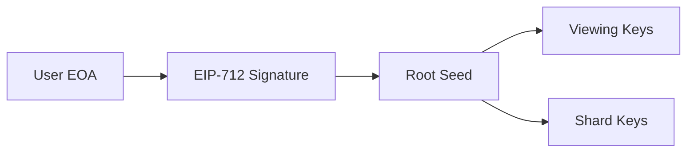
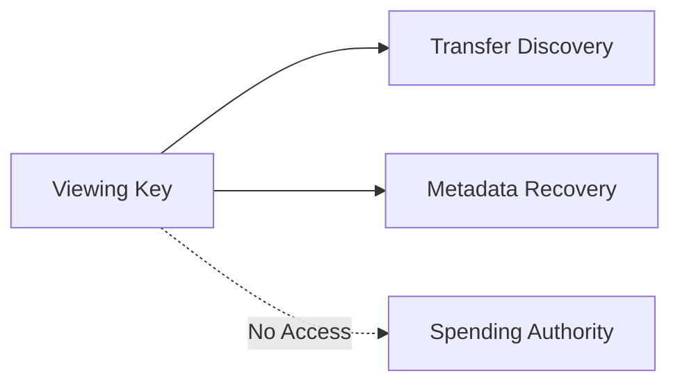
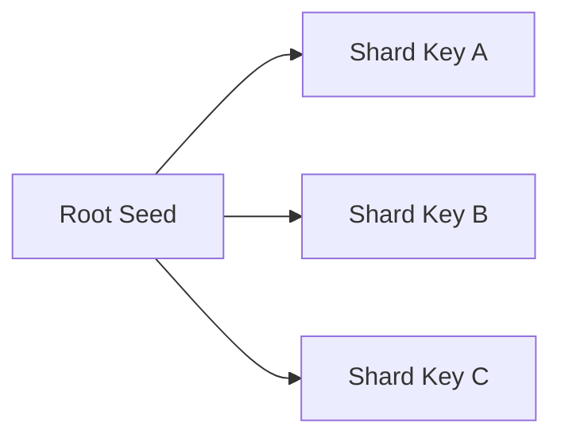

## 10.7 Key Management Security

> **Question:** What happens if secret material is compromised?

The security of GhostShard ultimately depends on the confidentiality of the cryptographic secrets used to derive ownership, discover incoming transfers, and authorize spending.

Unlike traditional account-based wallets, GhostShard separates responsibilities across multiple classes of keys. As a result, compromise of one key does not necessarily imply compromise of all protocol security properties.

This section analyzes the consequences of compromise for each key class and identifies the resulting security boundaries.

---

### 10.7.1 Root Seed Security

The root seed is the master secret from which all protocol keys are deterministically derived.

Conceptually:

$$
\text{Root Seed}
\rightarrow
{\text{Shard Keys},\ \text{Viewing Keys},\ \text{Future Derived Keys}}
$$

The root seed is generated from a domain-separated EIP-712 signature during wallet initialization.

The root seed represents the highest-value secret within the GhostShard architecture.

#### Compromise Impact

Compromise of the root seed results in complete loss of security.

An attacker obtaining the root seed can:

* Derive all shard private keys.
* Derive all viewing keys.
* Discover historical transfers.
* Discover future transfers.
* Spend all currently controlled shards.
* Reconstruct the user's entire wallet state.

In practical terms, root-seed compromise is equivalent to full wallet compromise.

#### Security Boundary

GhostShard v0 does not implement:

* Root-seed rotation.
* Root-seed revocation.
* Key migration.
* Protocol-level recovery.

Consequently, protection of the root seed remains the user's primary security responsibility.

---

### 10.7.2 Viewing Key Compromise

Viewing keys provide ownership-discovery capabilities without granting spending authority.

A viewing key holder can:

* Discover incoming transfers.
* Recover stealth-address ownership.
* Decrypt associated metadata.
* Reconstruct wallet balances.

However, viewing keys do not authorize spending.

#### Compromise Impact

Viewing-key compromise results primarily in privacy loss.

An attacker may obtain visibility into:

* Incoming transfers.
* Transfer timing.
* Transfer values.
* Sender metadata.

However, the attacker cannot:

* Spend assets.
* Produce transfer authorizations.
* Modify ownership records.
* Create valid shard signatures.

#### Security Boundary

Viewing-key compromise affects privacy but not fund safety.

This separation is an intentional design goal of the GhostShard architecture.

#### Operational Considerations

Viewing keys may be shared with auditors, accountants, compliance providers, or monitoring systems.

Such sharing should be treated as a deliberate privacy decision because it grants long-term visibility into wallet activity.

---

### 10.7.3 Shard-Key Compromise

Each shard possesses an independent spending key.

Ownership authorization occurs at the shard level rather than at the wallet level.

#### Compromise Impact

Compromise of a shard key affects only the corresponding shard.

The attacker may:

* Spend that shard.
* Authorize transfers using that shard.

The attacker cannot automatically:

* Spend unrelated shards.
* Recover the root seed.
* Derive viewing keys.
* Control the remainder of the wallet.

#### Security Boundary

This compartmentalization significantly limits blast radius.

Unlike conventional account-based wallets where a single key controls all assets, GhostShard distributes authorization authority across independent shard keys.

#### Exposure Window

Because shards are one-time-use objects, the usefulness of a compromised shard key ends once the shard has been consumed.

Consequently, shard-key compromise produces a naturally bounded exposure period.

---

### 10.7.4 Device Compromise

GhostShard cannot protect users against compromise of the device responsible for key management.

Examples include:

* Malware.
* Keyloggers.
* Remote-access trojans.
* Memory scraping attacks.
* Browser compromise.

The consequences depend on which secrets become accessible.

| Captured Secret  | Consequence               |
| ---------------- | ------------------------- |
| Viewing Key      | Privacy compromise        |
| Single Shard Key | Localized fund compromise |
| Root Seed        | Full wallet compromise    |

#### Security Boundary

Device security lies outside the protocol security model.

GhostShard assumes that cryptographic secrets remain confidential on the user's device.

Once a device becomes hostile, protocol-level protections become substantially weaker.

#### Mitigations

Operational protections include:

* Hardware wallets.
* Secure enclaves.
* Isolated signing environments.
* Memory-hard storage protections.
* Dedicated wallet devices.

---

### 10.7.5 Recovery and Rotation Limitations

GhostShard v0 intentionally prioritizes deterministic key derivation and simplicity over complex recovery mechanisms.

Unlike conventional wallet architectures, the root seed is not a randomly generated secret that exists independently of the user's wallet.

Instead, it is deterministically derived from an EIP-712 signature produced by the user's root wallet during initialization.

As a result, loss of a locally stored root seed does not necessarily result in permanent loss of access.

Provided the user still controls the original root wallet, the root seed can be deterministically regenerated and the entire GhostShard key hierarchy reconstructed.

However, GhostShard v0 does not currently support:

* Viewing-key revocation.
* Viewing-key rotation.
* Shard-key rotation.
* Automatic ownership migration.
* Recovery from loss of the root wallet itself.

If the root wallet is permanently lost, access to the corresponding GhostShard key hierarchy is also permanently lost.

Similarly, if a viewing key is disclosed, there is no mechanism to revoke or invalidate that disclosure. The compromised party retains visibility into both historical and future transfers associated with that viewing key.

These limitations arise from the deterministic key architecture adopted by GhostShard v0.

Future versions may explore:

* Hierarchical key rotation.
* Time-bounded viewing keys.
* Social recovery systems.
* Multi-signature shard authorization.
* Recovery-oriented ownership migration.
* Wallet-migration procedures for deterministic key hierarchies.
