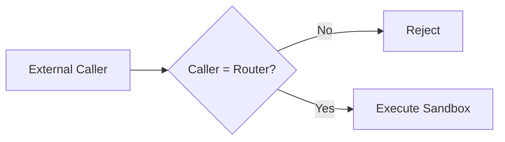
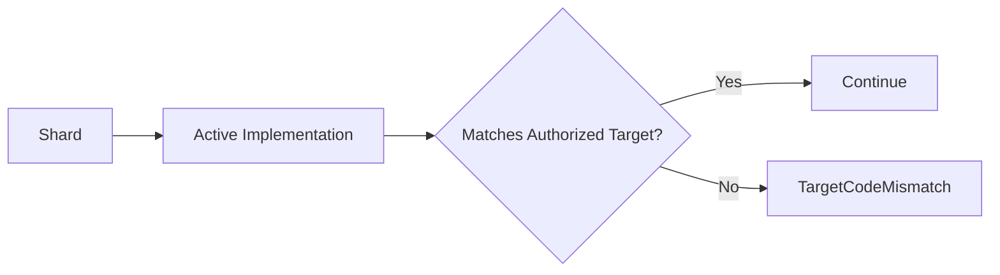
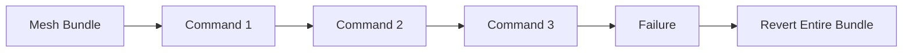
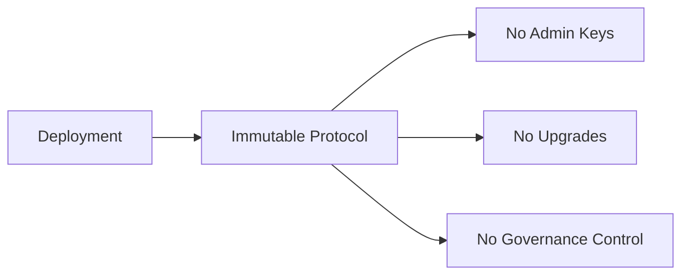

## 10.8 Smart Contract Security

> **Question:** What prevents contract-level exploits?

This section analyzes the security properties of the GhostRouter and GhostShard contracts, focusing on reentrancy resistance, authorization validation, state consistency, execution atomicity, and protocol immutability.

---

### 10.8.1 Reentrancy Analysis

GhostRouter follows a strict checks-effects-interactions execution model and employs OpenZeppelin's ReentrancyGuard on all externally callable state-mutating entry points.

The router performs critical state updates before any asset-transfer operations occur.

Conceptually:

$$
\texttt{isShardSpent}(\texttt{shard})
\leftarrow
\texttt{true}
$$

occurs before transfer execution begins.

Similarly:

* Paymaster deposits are debited before user execution.
* Withdrawal balances are reduced before ETH transfers.
* Accounting state is updated before external interactions.

Additionally, OpenZeppelin's `nonReentrant` protection is applied to externally callable entry points, including:

* `executeMesh()`
* `withdrawGas()`

This prevents malicious contracts from recursively invoking router functions during execution.

Asset transfers are executed through the isolated execution sandbox.

Execution is permitted only when:

$$
\texttt{caller}=\texttt{Router}
$$

and rejected otherwise:

$$
\texttt{caller}
\neq
\texttt{Router}
;\Longrightarrow;
\texttt{ExecutionRejected}
$$

As a result, even if a GhostShard implementation or token contract attempted to reenter the router during execution, nested mesh execution would be blocked by the reentrancy guard.

The `onlyRouter` restriction on GhostShard further ensures that transfer functions cannot be invoked directly by arbitrary external actors.

Finally, execution occurs within explicitly bounded gas limits supplied by the bundler and paymaster authorization. These limits constrain resource consumption and reduce the impact of malicious implementations attempting to consume excessive gas.

---

### 10.8.2 Authorization Validation

Before execution begins, GhostRouter validates the active EIP-7702 delegation target associated with every participating shard.

Conceptually, the following invariant must hold:

$$
\texttt{ActiveImplementation}=\texttt{AuthorizedImplementation}
$$

If:

$$
\texttt{ActiveImplementation}
\neq
\texttt{AuthorizedImplementation}
$$

execution immediately reverts with:

$$
\texttt{TargetCodeMismatch}
$$

This validation ensures that each shard's runtime code points to the expected GhostShard implementation.

A malicious relayer cannot:

* Substitute implementations.
* Redirect delegation targets.
* Submit unauthorized shard executions.
* Manipulate delegation state to extract gas refunds.

Validation occurs before any state mutation or asset transfer.

Transient storage is used to track shard participation within a single batch execution. This allows multiple operations involving the same shard during execution while ensuring that the shard is permanently retired once the transaction completes.

---

### 10.8.3 State Consistency

GhostShard enforces a collection of protocol invariants designed to maintain execution correctness and prevent unauthorized state transitions.

The following conditions are explicitly verified:

* `ShardAlreadySpent` — prevents reuse of retired shards.
* `InvalidSignature` — ensures transfer authorization originates from the shard owner.
* `InvalidPaymasterSignature` — ensures sponsorship approval matches the executed bundle.
* `PaymasterExpired` — ensures sponsorship remains within its validity period.
* `InsufficientPaymasterDeposit` — ensures sufficient prefunding exists.
* `GasPriceTooHigh` — ensures execution remains within approved gas limits.
* `CannotAnnounceSpentShard` — prevents retired shards from appearing as new outputs.
* `TargetCodeMismatch` — prevents execution under an unexpected delegation target.

Collectively these invariants enforce:

$$
\texttt{Execution}
\Rightarrow
\texttt{ValidAuthorization}
\land
\texttt{ValidSponsorship}
\land
\texttt{ValidDelegation}
\land
\texttt{ConsistentState}
$$

Execution therefore proceeds only under a fully validated authorization and accounting state.

---

### 10.8.4 Failure Atomicity

Mesh execution is designed to be atomic.

All user operations execute within the isolated execution sandbox.

If any command fails due to:

* Invalid signatures.
* Authorization mismatches.
* Failed transfers.
* Invariant violations.
* Sponsorship failures.

the entire execution reverts.

Conceptually:

$$
\exists i \in \texttt{Commands}
:
\texttt{Failure}(i)
\Longrightarrow
\texttt{Revert(All)}
$$

Consequently:

* No partial asset transfers occur.
* No partially processed shard states persist.
* No inconsistent ownership state can be created.

Execution outcomes are recorded through the `MeshExecuted` event, which captures both successful and failed execution paths.

Gas accounting remains deterministic even during failure scenarios.

Relayers are compensated only for actual gas consumed up to the prefunded limit, while unused prefund is automatically returned to the paymaster deposit balance.

---

### 10.8.5 Upgrade and Governance Assumptions

GhostRouter and GhostShard are intentionally designed as immutable protocol components.

There is no:

* Owner account.
* Admin key.
* Upgrade proxy.
* Governance-controlled parameter set.
* Self-destruct functionality.
* Arbitrary delegatecall execution path.

Once deployed, protocol behavior cannot be modified.

This design eliminates several common attack surfaces:

* Governance capture.
* Upgrade vulnerabilities.
* Admin-key compromise.
* Privileged execution abuse.

The tradeoff is that discovered bugs cannot be patched in place.

Security therefore depends on:

* Rigorous design review.
* Comprehensive testing.
* Public scrutiny.
* Independent security audits.

The contracts remain intentionally compact (approximately 378 lines for GhostRouter and 120 lines for GhostShard), making complete audit review and on-chain verification practical.

GhostShard v0 assumes the correctness of:

* The Ethereum Virtual Machine.
* EIP-7702 delegation semantics.
* The ERC-5564 announcement registry.
* OpenZeppelin security primitives used throughout the implementation.

Under these assumptions, the contract architecture provides strong resistance against common smart-contract attack classes while maintaining deterministic and auditable execution behavior.
