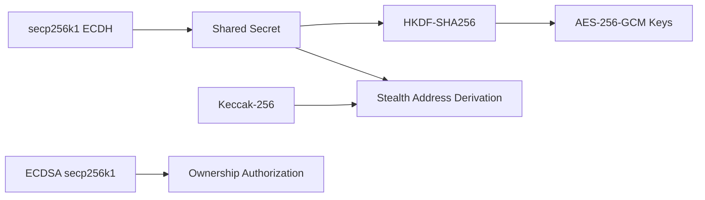

## 10.9 Cryptographic Assumptions

GhostShard v0 derives its security from established cryptographic primitives that are already relied upon by Ethereum and extensively studied within the cryptographic literature.

The protocol introduces no novel cryptographic assumptions. Instead, its security reduces to the security of the underlying primitives used for key exchange, digital signatures, hashing, authenticated encryption, and key derivation.

A successful attack against GhostShard's privacy or ownership model would therefore require breaking one or more of these underlying cryptographic assumptions.

---

### 10.9.1 ECDH Security

Stealth address derivation and metadata key generation rely on Elliptic Curve Diffie-Hellman (ECDH) over secp256k1.

Given:

* (E = eG) (ephemeral public key)
* (V = vG) (recipient viewing public key)

the protocol derives the shared secret:

[
S = evG
]

Security relies on the Computational Diffie-Hellman (CDH) assumption: given only (E) and (V), it is computationally infeasible to compute (S) without knowledge of either private scalar (e) or (v).

The resulting shared secret is subsequently processed through cryptographic hash functions and HKDF before being used by higher-level protocol components.

A successful break of secp256k1 ECDH would allow an attacker to:

* Recover shared secrets,
* Link stealth addresses to recipients,
* Decrypt announcement metadata,
* Defeat recipient privacy.

This is the same discrete-logarithm assumption that underlies Ethereum account security and ECDSA signatures.

---

### 10.9.2 Stealth Address Security

GhostShard uses ERC-5564-style stealth addressing to decouple public recipient identities from on-chain receiving addresses.

Each stealth shard is deterministically derived from:

* The recipient's spending public key,
* The ECDH-derived shared secret.

Without access to the shared secret, an observer cannot:

* Determine whether a stealth shard belongs to a particular meta-address,
* Link multiple stealth shards to the same recipient,
* Recover the shard's private key,
* Predict future shard addresses.

Stealth address privacy therefore reduces to the security of:

* secp256k1 ECDH,
* Keccak-256,
* Secure key derivation.

Knowledge of a shard address alone provides no practical method for deriving the corresponding private key.

---

### 10.9.3 AES-GCM Security

GhostShard encrypts announcement metadata using AES-256-GCM.

AES-GCM provides both confidentiality and integrity guarantees and is widely deployed across modern cryptographic protocols.

#### Confidentiality

AES-GCM satisfies indistinguishability under chosen-plaintext attack (IND-CPA), meaning ciphertexts are computationally indistinguishable from random data without knowledge of the encryption key.

An observer who does not possess the correct encryption key cannot feasibly recover the plaintext metadata or distinguish encrypted metadata from random data.

#### Integrity

AES-GCM additionally provides ciphertext authenticity (INT-CTXT).

Any modification to:

* Ciphertext contents,
* Initialization vectors (IVs),
* Authentication tags,

will be detected during decryption with overwhelming probability.

For a 128-bit authentication tag, the probability of successfully forging a valid ciphertext is approximately:

$$
2^{-128}
$$

which is negligible for all practical attack scenarios.

Consequently, an attacker cannot modify encrypted metadata without detection.

#### IV Collision Analysis

A fresh uniformly random 96-bit initialization vector (IV) is generated for every announcement encryption.

Assuming secure random IV generation, the probability of at least one IV collision after (N) encryptions is approximately:

$$
P_{\text{collision}}
\approx
\frac{N(N-1)}{2^{97}}
$$

by the birthday bound.

For large values of (N), this is often approximated as:

$$
P_{\text{collision}}
\approx
\frac{N^2}{2^{97}}
$$

Even for extremely large announcement volumes, the probability of an IV collision remains negligible.

For example, after:

$$
N = 10^9
$$

encrypted announcements,

$$
P_{\text{collision}}
\approx
6.3 \times 10^{-12}
$$

which is effectively zero for practical deployment scenarios.

The security analysis assumes IVs are generated using a cryptographically secure random number generator. Under this assumption, accidental IV reuse is not expected to occur during the operational lifetime of the protocol.

---

### 10.9.4 HKDF Security

GhostShard uses HKDF-SHA256 to derive cryptographic subkeys from ECDH-generated shared secrets.

Domain-separated context strings are used to prevent key reuse across protocol functions:

* `"ghost-shard-metadata"`
* `"ghost-shard-ephemeral"`

HKDF security reduces to the security of:

* HMAC-SHA256,
* SHA-256 preimage resistance,
* SHA-256 collision resistance.

Compromise of one derived key does not reveal sibling keys generated under different HKDF contexts.

This property provides cryptographic isolation between metadata encryption, ephemeral derivation, and future protocol extensions.

---

### 10.9.5 Signature Security

Ownership authorization relies on secp256k1 ECDSA signatures.

Every transfer command must be signed by the corresponding shard owner.

Security depends on the infeasibility of:

* Recovering private keys from public keys,
* Forging valid ECDSA signatures,
* Producing signature collisions.

An attacker capable of forging valid secp256k1 signatures could authorize arbitrary asset transfers and defeat ownership controls.

This is the same assumption relied upon by Ethereum accounts, transactions, and smart-contract wallets.

---

### 10.9.6 Security Reduction Summary

GhostShard introduces no trusted setup and no novel cryptographic primitives.

The protocol's security reduces to the following established assumptions:

| Primitive       | Security Assumption             |
| --------------- | ------------------------------- |
| secp256k1 ECDH  | Computational Diffie-Hellman    |
| secp256k1 ECDSA | Discrete Logarithm Problem      |
| Keccak-256      | Preimage Resistance             |
| SHA-256         | Preimage & Collision Resistance |
| HKDF-SHA256     | HMAC Security                   |
| AES-256-GCM     | IND-CPA + INT-CTXT              |

Consequently, breaking GhostShard's privacy or ownership guarantees requires breaking cryptographic assumptions already relied upon by Ethereum itself.

---

### 10.9.7 Post-Quantum Considerations

Like Ethereum, GhostShard v0 is not post-quantum secure.

Large-scale quantum computers capable of executing Shor's algorithm would compromise:

* secp256k1 ECDH,
* secp256k1 ECDSA,
* Stealth address derivation,
* Shared-secret generation.

Grover's algorithm reduces the effective security level of symmetric primitives:

* AES-256 provides approximately 128 bits of post-quantum security.
* SHA-256 and Keccak-256 retain reduced but still substantial preimage resistance.

Although GhostShard v0 is not quantum resistant, the architecture was intentionally designed to support future migration paths.

Potential upgrade paths include:

* Post-quantum key exchange schemes,
* Post-quantum signature algorithms,
* Alternative stealth address derivation mechanisms.

The ERC-5564 `schemeId` field provides a protocol-level mechanism for introducing alternative cryptographic schemes without requiring changes to the surrounding transaction architecture.

---

### 10.9.8 Trusted Setup Assumptions

GhostShard requires:

* No trusted setup,
* No ceremony,
* No structured reference string,
* No multi-party parameter generation process.

All cryptographic operations rely exclusively on deterministic derivation or publicly generated randomness such as:

* Ephemeral key pairs,
* AES-GCM initialization vectors.

As a result, GhostShard avoids the operational and trust assumptions commonly associated with zk-SNARK-based privacy systems.
