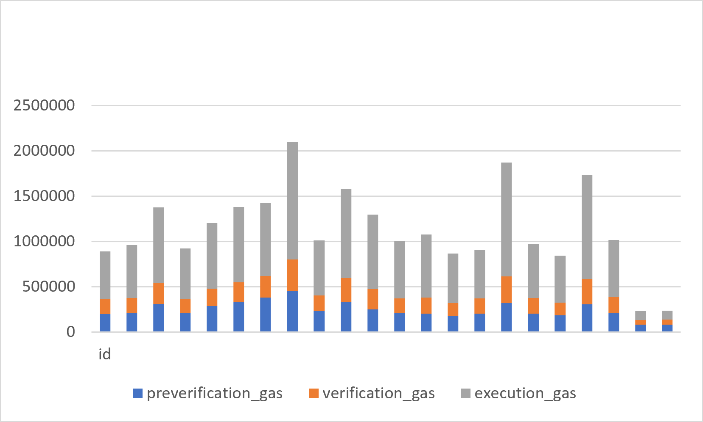

## 11.2 Gas Cost Breakdown

This section analyzes where gas is consumed during GhostShard execution.

For every mesh transaction, total gas consumption can be decomposed into three independent components:

$$
G_{\text{total}}=G_{\text{preverification}}
+
G_{\text{verification}}
+
G_{\text{execution}}
$$

where:

$$
G_{\text{preverification}}=G_{\text{total}}-G_{\text{contract}}
$$

$$
G_{\text{verification}}=G_{\text{contract}}-G_{\text{execution}}
$$

and

$$
G_{\text{execution}}=G_{\text{innerExecuteMesh}}
$$

corresponds to the gas consumed inside the isolated mesh execution sandbox recorded through the `MeshExecuted` event.

Conceptually,

$$
\text{Total Gas}=\underbrace{\text{Transaction Validation}}*{\text{Preverification}}
+
\underbrace{\text{Protocol Logic}}*{\text{Verification}}
+
\underbrace{\text{Asset Movement}}_{\text{Execution}}
$$

The separation is useful because each component scales differently.

* Preverification gas is primarily driven by EIP-7702 authorization processing and transaction-level validation.
* Verification gas captures GhostRouter ownership checks, replay protection, delegation validation, and paymaster verification.
* Execution gas captures actual protocol work, including asset transfers, announcement publication, and mesh execution.

---

### Figure 11.2.1 — Total Gas Breakdown Per Transaction

*Figure 11.2.1. Execution gas dominates total consumption across all transaction categories, while preverification and verification overhead scale with transaction complexity.*

---
### Figure 11.2.2 — Average Gas Decomposition by Asset Type

*Figure 11.2.2. Average gas decomposition across measured asset classes. Execution gas is the dominant contributor for all asset types.*

### Table 11.2.1 — Average Gas Decomposition by Asset Type

| Asset Type | Average Preverification Gas | Average Verification Gas | Average Execution Gas | Average Total Gas |
| ---------- | --------------------------: | -----------------------: | --------------------: | ----------------: |
| ERC-20     |                     292,935 |                  214,660 |               776,367 |         1,283,962 |
| Native     |                     224,553 |                  193,749 |               738,516 |         1,156,818 |
| ERC-721    |                      80,320 |                   52,681 |                98,909 |           231,910 |

---

### Figure 11.2.3 — Relative Gas Composition by Asset Type

*Figure 11.2.3. Relative contribution of each gas component. For both Native and ERC-20 transfers, approximately 60–64% of total gas is spent performing protocol execution rather than administrative validation.*

### Table 11.2.2 — Relative Gas Composition by Asset Type

| Asset Type | Preverification (%) | Verification (%) | Execution (%) |
| ---------- | ------------------: | ---------------: | ------------: |
| ERC-20     |               22.81 |            16.72 |         60.47 |
| Native     |               19.41 |            16.75 |         63.84 |
| ERC-721    |               34.63 |            22.72 |         42.65 |

---

### Observations

Several observations emerge from the decomposition.

* Execution gas is the dominant contributor across all measured transactions.
* Verification gas forms the second-largest component and scales with participating shard count.
* Preverification gas remains the smallest component but increases with transaction complexity because each additional shard introduces EIP-7702 authorization overhead.
* ERC-20 and Native transfers exhibit similar cost structures despite different transfer mechanisms.
* ERC-721 transactions appear significantly cheaper due to the limited complexity of the measured sample.
* The relatively small difference between Native and ERC-20 execution costs suggests that GhostShard amortizes much of its fixed protocol overhead across multiple transfers.

Overall, the decomposition demonstrates that GhostShard spends the majority of gas performing useful protocol work rather than administrative validation.
