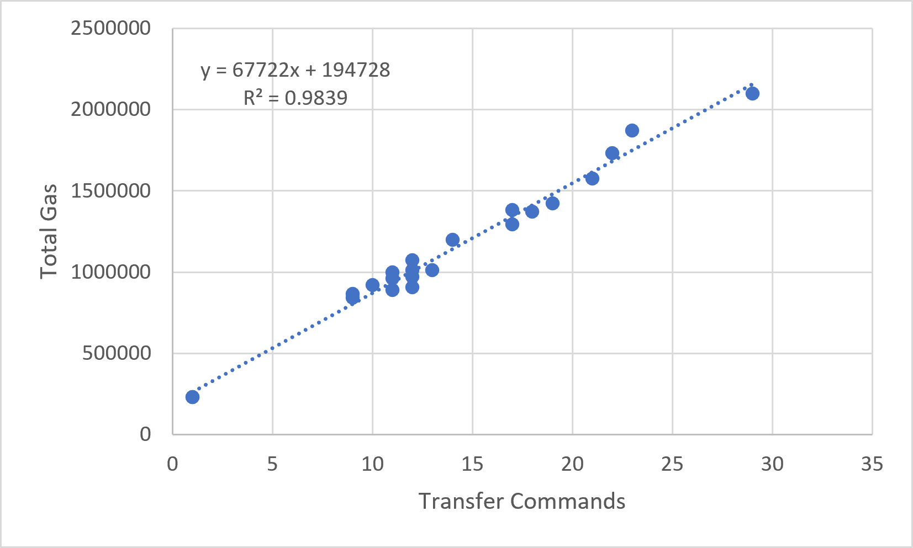
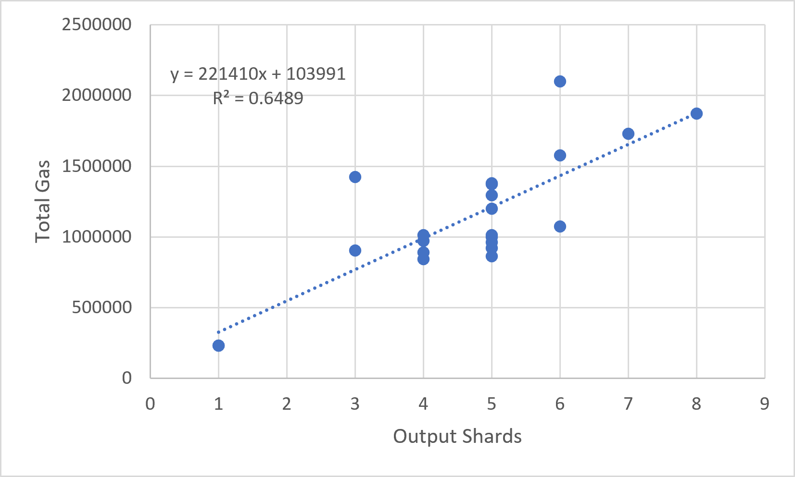

## 11.3 Scaling Analysis

This section evaluates how GhostShard scales as transaction complexity increases.

Three observable variables are considered:

* Input shards ($N_i$)
* Output shards ($N_o$)
* Transfer commands ($N_t$)

All three quantities emerge naturally from the coin-selection and mesh-construction algorithms described in Chapter 7.

### Transfer Commands as the Unit of Work

An important observation from the dataset is that transfer count and input count are not equivalent.

For example:

* TX-01 uses 4 input shards but produces 11 transfer commands.
* TX-07 uses 9 input shards but produces 19 transfer commands.

This demonstrates that a single shard may generate multiple transfer commands when value is partitioned across multiple outputs.

Consequently, transfer count is a more accurate representation of protocol workload than shard count alone.

---

### Figure 11.3.1 — Total gas vs Transfer count.

---

#### Observation

Transfer count is the strongest predictor of gas consumption observed in the evaluation.

Approximately:

$$
98.4%
$$

of the variation in total gas usage is explained solely by transfer count.

No evidence of super-linear growth was observed across the measured range of:

$$
1 \leq N_t \leq 29
$$

transfer commands.

This result indicates that GhostShard scales approximately linearly with protocol work.

---

### Figure 11.3.2 — Total gas vs Input Shard count.

---

#### Observation

Input count remains strongly correlated with gas consumption but performs significantly worse than transfer count.

This occurs because input count does not fully capture protocol workload.

Two transactions may consume the same number of shards while producing different numbers of transfer commands.

As a result, shard count serves only as an approximate proxy for transaction complexity.

---

### Figure 11.3.2 — Total gas vs Output Shard count.

---

#### Observation

Output count exhibits the weakest relationship with gas consumption.

While output creation contributes to execution cost, recipient count alone does not accurately describe protocol workload.

Transactions containing identical output counts may perform substantially different numbers of transfers.

Consequently, output count should not be considered a primary scaling metric.

---

### Scaling Summary

| Relationship                   | Regression Model       |     $R^2$ |
| ------------------------------ | ---------------------- | --------: |
| Total Gas vs Transfer Commands | $194,728 + 67,722N_t$  | **0.984** |
| Total Gas vs Input Shards      | $72,493 + 204,182N_i$  |     0.824 |
| Total Gas vs Output Shards     | $103,991 + 221,410N_o$ |     0.649 |

---

### Discussion

The evaluation demonstrates that transfer commands constitute the primary unit of protocol work within GhostShard.

Transfer count substantially outperforms both input count and output count as a predictor of gas consumption.

The near-linear relationship observed in Figure 3 suggests that GhostShard scales predictably as transaction complexity increases.

Within the evaluated range, each additional transfer command contributes approximately:

$$
68,000
\text{ gas}
$$

on average.

This behavior is consistent across Native and ERC-20 transactions and provides evidence that GhostShard's execution model scales linearly rather than super-linearly.

Among all results presented in Chapter 11, Figure 3 represents the strongest empirical validation of the protocol's scalability properties.
