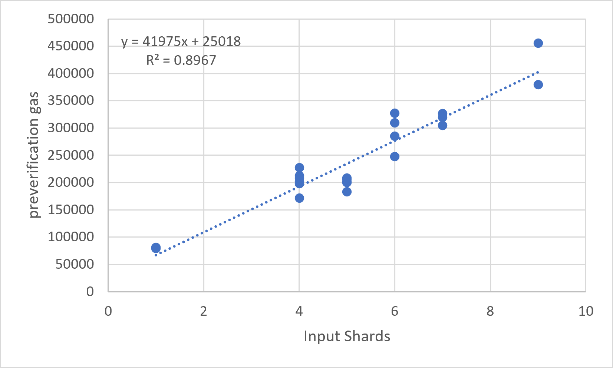
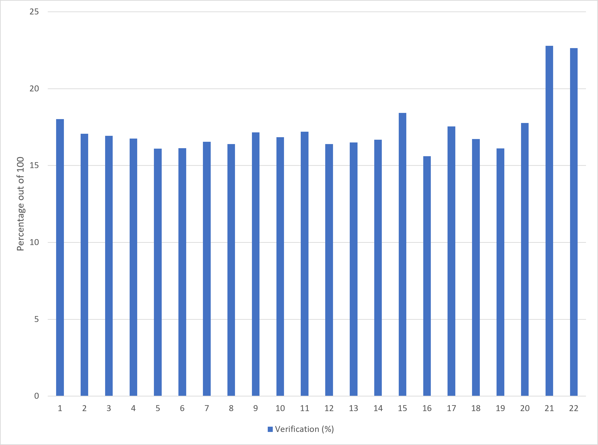

## 11.4 Verification Cost Scaling

This section isolates the **authorization and validation layer** of GhostShard — the gas consumed proving that a transaction is valid before any asset movement occurs.

Because GhostShard separates validation from execution through its pre-scan matrix architecture, verification costs can be measured independently from asset-transfer costs.

Verification gas is defined as:

$$
G_{\text{verification}}=G_{\text{contract}}-G_{\text{execution}}
$$

where:

* $G_{\text{contract}}$ is the gas consumed inside GhostRouter execution.
* $G_{\text{execution}}$ is the gas reported by the isolated mesh execution sandbox (`innerExecuteMesh`).

Similarly, pre-verification gas is defined as:

$$
G_{\text{preverification}}=G_{\text{total}}-G_{\text{contract}}
$$

This decomposition allows validation overhead to be analyzed separately from asset-transfer costs.

---

### Figure 11.4.1 —  Pre-verification Gas vs Input Shards.

---

### Table 11.4.1 —  Pre-verification Gas vs Input Shards Observed Ranges.

| Metric  |       Value |
| ------- | ----------: |
| Minimum |  79,520 gas |
| Maximum | 455,238 gas |
| Mean    | 245,674 gas |

Pre-verification gas exhibits substantial variation, ranging from approximately 80k gas for single-input ERC-721 transactions to over 450k gas for the largest measured mesh transaction.

Unlike execution gas, pre-verification gas does not appear to scale solely as a function of input count.

This behavior is expected because pre-verification includes:

* Transaction calldata processing.
* EIP-7702 authorization validation.
* Signature payload decoding.
* Command-array decoding.
* Announcement-array decoding.
* L1 data fees if applicable

Consequently, transactions with similar numbers of input shards may exhibit noticeably different pre-verification costs if their calldata payloads differ significantly.

The scatter plot therefore demonstrates that pre-verification gas is influenced by overall transaction complexity rather than shard count alone.

---

### Figure 11.4.2 — Verification Gas vs Transfer Commands.

---

### Table 11.4.2 — Verification Gas vs Transfer Commands Observed Ranges.

| Metric  |       Value |
| ------- | ----------: |
| Minimum |  52,681 gas |
| Maximum | 344,502 gas |
| Mean    | 190,084 gas |

Verification gas displays a strong linear relationship with transfer-command count.

The smallest transactions (single ERC-721 transfers) require approximately:

$$
52,681
\text{ gas}
$$

of verification overhead.

The largest measured transaction:

$$
N_t = 29
$$

requires:

$$
344,502
\text{ gas}
$$

of verification overhead.

The resulting trend demonstrates that validation costs scale proportionally with protocol work.

A linear regression should be reported in the final figure:

$$
G_{\text{verification}}=a
+
bN_t
$$

where:

* $a$ represents fixed protocol overhead.
* $b$ represents marginal verification cost per transfer command.

$$
R^2 \approx 0.997
$$

The strong visual linearity suggests that verification overhead scales predictably and does not exhibit super-linear growth.

---

### Figure 11.4.3 — Verification Gas as a Percentage of Total Gas

---

#### Representative Measurements

| Transaction Type          | Verification Share |
| ------------------------- | -----------------: |
| ERC-721 (single transfer) |              22.8% |
| Medium mesh transaction   |               ~17% |
| Large mesh transaction    |               ~16% |

Verification overhead remains bounded across all measured workloads.

The measured verification fraction ranges approximately from:

$$
16%
;\text{to};
23%
$$

of total transaction gas.

The highest percentage occurs in very small transactions because fixed protocol overhead dominates total cost.

As transaction size increases, the verification fraction decreases slightly because fixed validation costs become amortized across a larger number of transfer commands.

This behavior indicates that GhostShard becomes relatively more efficient as transaction complexity increases.

---

### Verification Scaling Summary

| Relationship                          | Strength | Interpretation                                              |
| ------------------------------------- | -------- | ----------------------------------------------------------- |
| Input Shards vs Pre-verification Gas  | Moderate | Influenced by calldata size and transaction structure       |
| Transfer Commands vs Verification Gas | Strong   | Verification cost scales proportionally with work performed |
| Verification Share of Total Gas       | Stable   | Remains bounded at approximately 16–23%                     |

#### Key Finding

The results demonstrate that GhostShard's validation layer scales predictably.

Verification overhead grows approximately linearly with transfer-command count while remaining a minority component of overall gas consumption.

Even for the largest measured transaction, verification remains substantially smaller than execution cost, confirming that the dominant gas consumer is productive protocol work (asset movement and announcement publication) rather than authorization overhead.
