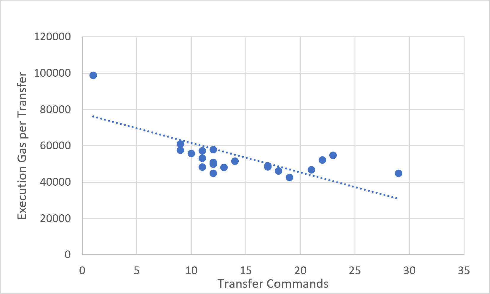
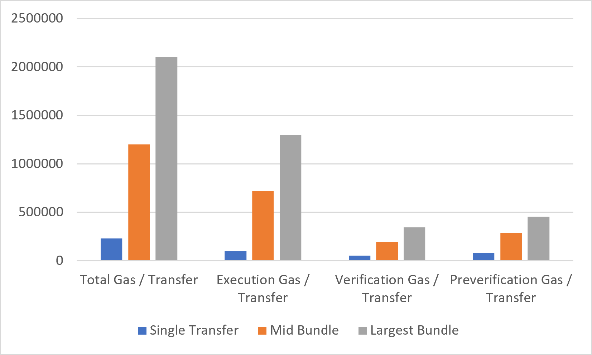

## 11.6 Amortization Analysis

This section evaluates how effectively GhostShard amortizes fixed protocol costs as more transfers are bundled into a single mesh transaction.

A core design goal of the protocol is to distribute transaction overhead across multiple transfers. Components such as paymaster validation, calldata processing, authorization verification, and execution setup introduce fixed costs that become less significant as transaction complexity increases.

---

### Figure 11.6.1 — Total Gas per Transfer vs Transfer Count

---

### Observation

The dataset shows a strong amortization effect.

Single-transfer transactions exhibit the highest effective cost:

$$
\approx 232,000
\text{ gas per transfer}
$$

As bundle size increases, effective cost decreases substantially.

The largest measured transaction:

$$
N_t = 29
$$

achieves:

$$
72,447
\text{ gas per transfer}
$$

representing approximately:

$$
3.2\times
$$

greater efficiency than a single-transfer transaction.

The reduction is not perfectly monotonic because transaction composition varies between samples, but the overall downward trend is clear across the dataset.

Several observations emerge:

* Most amortization benefits are realized between 1 and approximately 12 transfers.
* Beyond approximately 15 transfers, gas-per-transfer begins to stabilize.
* Large bundles consistently remain within the 72k–82k gas-per-transfer range.
* No evidence of efficiency degradation appears at higher transfer counts.

These results indicate that GhostShard successfully distributes fixed transaction costs across multiple transfers.

---

### Figure 11.6.2 — Execution Gas per Transfer vs Transfer Count

---

### Observation

Execution gas exhibits a similar but weaker amortization trend.

Single-transfer transactions require:

$$
98,909
\text{ gas}
$$

of execution work.

The largest measured transaction reduces this to:

$$
44,870
\text{ gas per transfer}
$$

representing approximately:

$$
2.2\times
$$

improvement.

Unlike total gas, execution gas is dominated by actual protocol work:

* Asset transfers
* Ownership updates
* Announcement publication
* Mesh settlement operations

Because these operations scale directly with the number of transfers, execution gas contains a larger variable component and therefore amortizes less aggressively.

The data shows execution gas per transfer stabilizing around:

$$
45,000
------

55,000
\text{ gas}
$$

for large bundles.

This suggests that the protocol's marginal execution cost approaches a relatively stable per-transfer value.

---

### Figure 11.6.3 — Amortization Efficiency by Gas Component

---

### Amortization Efficiency Summary

| Metric                         | Single Transfer | Largest Bundle (29 Transfers) | Improvement |
| ------------------------------ | --------------: | ----------------------------: | ----------: |
| Total Gas / Transfer           |           ~232k |                         72.4k |       ~3.2× |
| Execution Gas / Transfer       |           98.9k |                         44.9k |       ~2.2× |
| Verification Gas / Transfer    |           52.7k |                         11.9k |       ~4.4× |
| Preverification Gas / Transfer |           79.5k |                         15.7k |       ~5.1× |

---

### Discussion

The strongest amortization occurs in the authorization layer.

Verification and preverification costs contain substantial fixed overhead originating from:

* Paymaster validation
* Authorization processing
* Signature verification
* Calldata decoding
* Transaction setup

These costs are incurred once per transaction and therefore shrink rapidly on a per-transfer basis as bundle size grows.

Execution costs amortize more slowly because they are tied directly to asset movement and announcement publication.

Consequently:

* Preverification achieves the largest efficiency gain (~5×).
* Verification achieves similar savings (~4×).
* Execution improves more modestly (~2×).
* Overall transaction efficiency improves by more than 3×.

The results demonstrate that GhostShard strongly rewards batching behavior. As transaction complexity increases, fixed protocol overhead becomes increasingly negligible relative to productive work, allowing large mesh transactions to operate at substantially lower effective cost per transfer.
